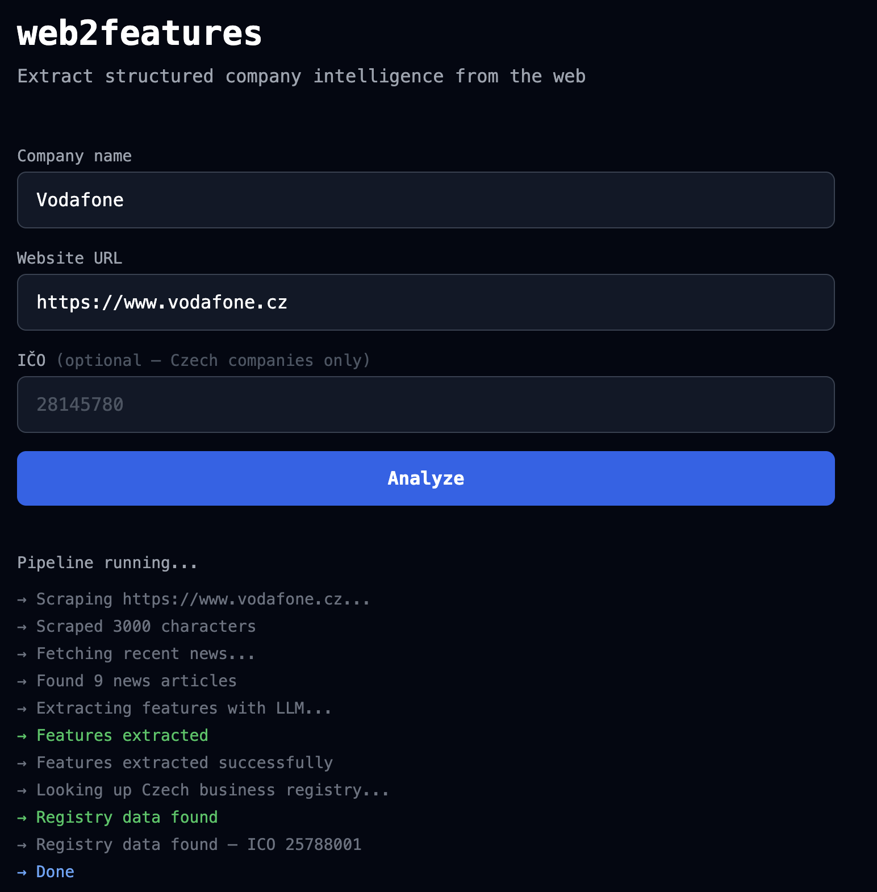
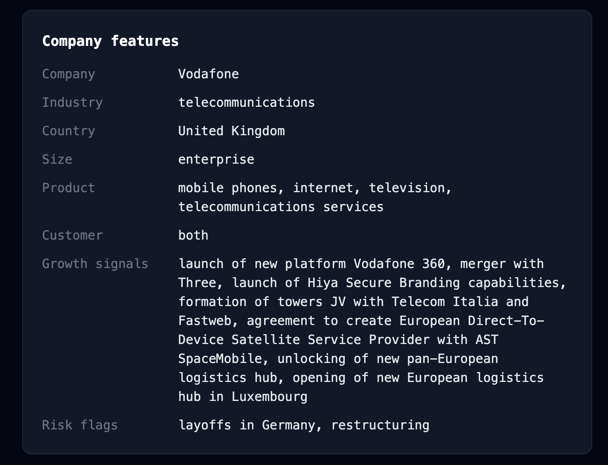
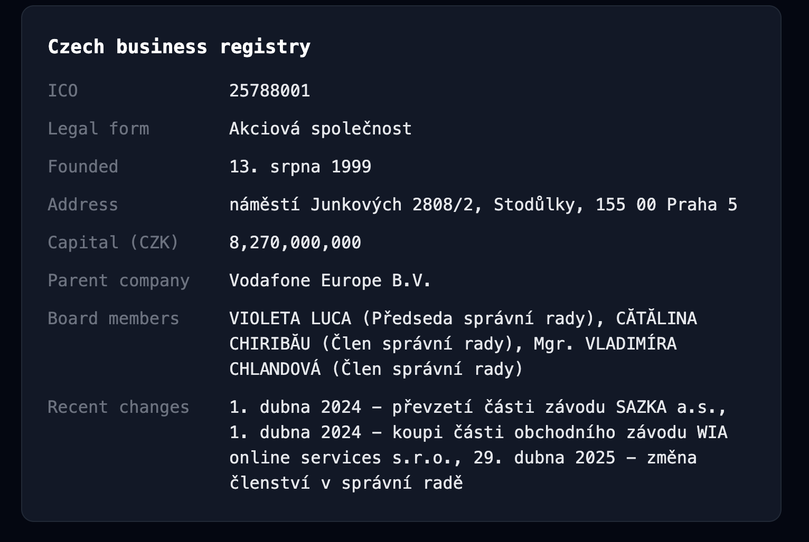

# web2features

A lightweight pipeline that converts unstructured company webpage text into 
structured, model-ready features using a local or cloud LLM.

Built as a proof-of-concept for the kind of external signal extraction used 
in fintech credit scoring and business intelligence.

## What it does

1. **Scrapes** a company's public webpage (`scraper.py`)
2. **Fetches recent news** via Bing News RSS for each company (`news_scraper.py`)
3. **Extracts structured features** from homepage + news via a local LLM prompt (`extractor.py`)
4. **Looks up Czech business registry** (`registry_scraper.py`) — for Czech companies,
   fetches authoritative data from justice.cz: legal form, founding date, registered
   capital, board members, ownership structure, and recent structural changes
5. **Web interface** (`app.py`) — Flask app with real-time streaming pipeline,
   deployable to Railway with HuggingFace API inference

## Output example





## Stack

- `curl_cffi` — reliable scraping against Cloudflare-protected sites
- `BeautifulSoup` — HTML parsing
- `ollama` — local LLM inference (llama3.1:8b)
- `huggingface_hub` — cloud LLM inference via HuggingFace API
- `llm_client.py` — unified LLM interface, switch between Ollama and HuggingFace via `LLM_PROVIDER` env var
- `pandas` — feature table output
- `registry_scraper.py` — hybrid LLM + regex extraction from Czech Business Registry
- `Flask` — web interface with real-time SSE streaming

## Setup
```bash
git clone https://github.com/elmir-mamedov/web2features.git
cd web2features
uv install
ollama pull llama3.1:8b
```

Copy `.env.example` to `.env` and fill in your values:
```bash
cp .env.example .env
```

## Usage

**CLI — single company:**
```bash
python main.py --url https://www.fidoo.com
```

**CLI — CSV input:**
```bash
python main.py --input companies.csv --output output/results.csv
```

**Web interface:**
```bash
python app.py
```
Open `http://localhost:5000`

**Deployed app:** https://web2features.up.railway.app/

## Known limitations

- News signals are sourced from Bing RSS — descriptions are often short and 
  recent coverage varies by company size. Less-known companies may return 
  irrelevant or sparse results.
- Entity disambiguation is imperfect — companies sharing a name with unrelated 
  entities (e.g. a Czech construction firm named Brex) can pollute news results. 
  Domain-based query helps but does not fully solve this.
- Prompt is English-only optimized — works on Czech but could be improved
- Registry lookup is Czech-only — foreign companies (Stripe, Revolut etc.) are skipped
  gracefully. A Companies House integration would cover UK companies.
- LLMs are unreliable with exact numbers — registered capital is extracted via regex
  rather than LLM to guarantee accuracy. Other numeric fields may still be imprecise.
- `search_ico()` uses company name search which can return the wrong entity for common
  names. Providing ICO directly is always more reliable.


## Next steps

- **Fine-tuning** — fine-tune llama3.1 on Czech registry extraction examples using 
  Unsloth + Google Colab, host on HuggingFace, call via API — would significantly 
  improve registry extraction reliability especially for edge cases (s.r.o. vs a.s., 
  foreign parent companies)
- **Multi-page scraping** — scrape `/about` and `/careers` pages per company for richer signal
- **Confidence scores** — rule-based confidence per extracted field so downstream models
  know which features to trust
- **Logprobs** — the theoretically correct way to measure extraction confidence is via
  log probabilities: the model's internal token-level probability distribution exposes
  how sure it was when choosing e.g. "B2B" over "B2C". Ollama exposes logprobs but
  field-level aggregation across multi-token values is non-trivial. Revisit when moving
  to a hosted model with a cleaner logprobs API (e.g. OpenAI).
- **DeepEval integration** — hallucination and faithfulness metrics to verify extracted
  features are actually grounded in the scraped text, not model training memory
- **RAG evolution** — pre-index company documents and news into a vector database
  (e.g. with `nomic-embed-text`) so features can be queried
  instantly rather than scraped on demand — the natural production-scale extension of
  this pipeline